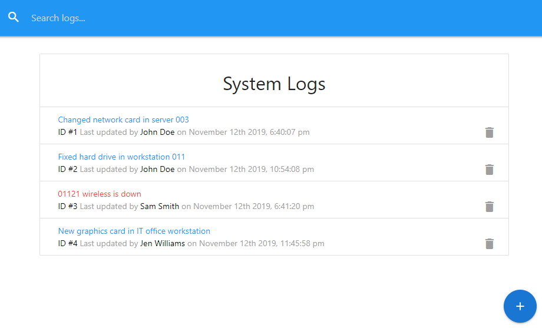

# it-logger

A react/redux application for logging and managing IT issues and technicians



## Getting Started

These instructions will get you a copy of the project up and running on your local machine for development and testing purposes.

### Cloning and installing

First, clone the repository using the following:

```
git clone https://github.com/bryce-mcmath/it-logger.git
```

If you don't have Nodejs and npm installed, install them from [here.](https://nodejs.org/en/)

Then, while in the root directory:

```
npm install
```

Finally:

```
npm run dev
```

## Built With

- [React](https://reactjs.org/) - The front-end framework used
- [Redux](https://redux.js.org/) - A predictable state container for JavaScript apps
- [json-server](https://my-json-server.typicode.com/) - Fake online REST server for teams
